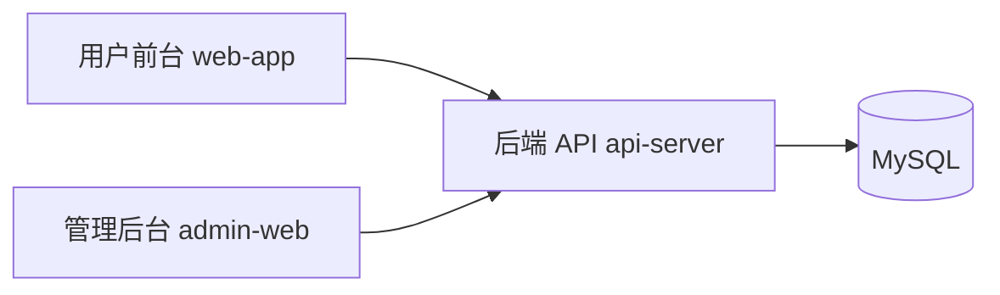

# 🏨 酒店管理系统（Hotel Management System）

> 一个包含 **后端 API + 用户前台 + 管理后台** 的完整酒店管理解决方案。


## ✨ 项目亮点

- 前后端分离架构，职责清晰，便于协作开发。
- 提供住客端与管理端双前端，覆盖完整业务流程。
- 支持订单、入住、房间、员工等核心酒店场景。
- 已整理统一目录命名，结构更规范、可维护性更好。

## 🧭 目录导航

- [项目架构](#-项目架构)
- [仓库结构](#-仓库结构)
- [快速开始](#-快速开始)
- [运行地址](#-运行地址)
- [功能模块](#-功能模块)
- [技术栈](#-技术栈)
- [文档索引](#-文档索引)

## 🏗 项目架构



## 📁 仓库结构

```text
hotel/
├── backend/
│   └── api-server/     # Spring Boot 后端 API
├── frontend/
│   └── web-app/        # Vue 2 用户前台
├── admin/
│   └── admin-web/      # Vue 2 管理后台
├── docs/               # 项目文档
├── scripts/            # 一键启动与运维脚本
├── PLAN.md             # 项目优化计划
└── README.md
```

## 🚀 快速开始

### 1) 前置环境

- Java 8
- MySQL 8.0+
- Node.js 14+

### 2) 初始化数据库

```bash
mysql -uroot -p123456
CREATE DATABASE hotel DEFAULT CHARACTER SET utf8mb4;
exit
mysql -uroot -p123456 hotel < backend/api-server/hotel.sql
```

### 3) 启动后端

```bash
cd backend/api-server
mvn spring-boot:run
```

### 4) 启动用户前台

```bash
cd frontend/web-app
npm install
npm run dev
```

### 5) 启动管理后台

```bash
cd admin/admin-web
npm install
npm run dev
```

### 6) 一键启动（可选）

- Windows：`scripts/start-all.bat`
- Linux/macOS：`bash scripts/start-all.sh`

## 🌐 运行地址

- 后端 API：`http://localhost:8080/ho-api`
- 用户前台：`http://localhost:8888`
- 管理后台：`http://localhost:9528`

## 🧩 功能模块

### 用户前台（`frontend/web-app`）

- 浏览酒店与房型信息
- 用户注册/登录
- 在线预订与订单管理
- 个人信息查看与维护

### 管理后台（`admin/admin-web`）

- 订单管理与状态流转
- 入住登记与退房处理
- 客户管理与员工管理
- 房间与房型管理

### 后端服务（`backend/api-server`）

- 认证与会话处理
- 订单、房间、入住等业务接口
- MyBatis 数据访问与业务逻辑封装

## 🛠 技术栈

| 层级         | 技术                              |
| ------------ | --------------------------------- |
| 后端         | Spring Boot 2.0.5、MyBatis、Maven |
| 前端（用户） | Vue 2、Muse UI、Webpack           |
| 前端（管理） | Vue 2、Element UI、Vuex、Webpack  |
| 数据库       | MySQL 8.0+                        |

## 📚 文档索引

- 环境搭建：`docs/SETUP.md`
- 接口说明：`docs/API.md`
- 架构说明：`docs/ARCHITECTURE.md`
- 目录规范：`docs/REPO_ORGANIZATION.md`
- 优化计划：`PLAN.md`

## 📄 许可证

[LICENSE](MIT)

## 👤 维护者

- The-niceU
